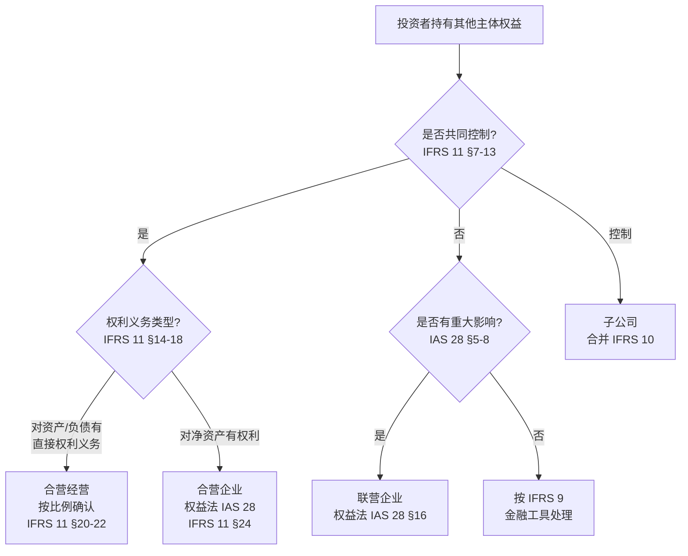

# IFRS 下合营与联营的定义及会计处理

> **TL;DR**：合营以**共同控制**为前提（IFRS 11），分合营经营（按比例确认）与合营企业（权益法）；联营以**重大影响**为前提（IAS 28），统一权益法。
> **关键依据**：IFRS 11 §7–8（共同控制）、§15–16（分类）；IAS 28 §3、§16（联营与权益法）
> **适用场景**：判断投资分类、选择会计处理方法、与子公司合并范围区分时

## 问题

### 背景

在 IFRS 体系下，投资者持有其他主体权益时，需先判断属于子公司、合营安排还是联营企业，再确定会计处理。

### 决策问题

1. **合营公司**与**联营公司**分别如何定义？
2. 投资者应分别采用何种会计处理方法？

### 边界

- 本文不涉及 IFRS 10 下**控制**与子公司合并的完整分析
- 不涉及 US GAAP 下 Equivalent 处理（见双准则对比类项目）

---

## 总体框架

IFRS 将「对其他主体的权益」按**控制程度**分层处理，合营与联营处于中间层级：

| 层级 | 关键概念 | 主要准则 | 典型会计处理 |
|------|---------|---------|-------------|
| 子公司 | **控制**（Control） | IFRS 10 | 合并财务报表 |
| 合营安排 | **共同控制**（Joint Control） | IFRS 11 | 合营经营：按比例确认；合营企业：权益法 |
| 联营企业 | **重大影响**（Significant Influence） | IAS 28 | 权益法 |
| 一般投资 | 无控制/共同控制/重大影响 | IFRS 9 | 按金融工具准则计量 |

> 合营与联营的核心区别在于**权力层级不同**：合营要求**共同控制**，联营仅要求**重大影响**（参与财务和经营决策，但非控制或共同控制）。

---

## 一、合营（Joint Arrangement）

### 1. 定义与前提：共同控制

**准则来源**：[[03 - 知识库/IFRS/IFRS准则/IFRS 11 - Joint Arrangements|IFRS 11]]

> **IFRS 11 Paragraph 4–6（知识库原文）：**
>
> A joint arrangement is an arrangement of which two or more parties have joint control.
>
> A joint arrangement has the following characteristics:
> (a) The parties are bound by a contractual arrangement.
> (b) The contractual arrangement gives two or more of those parties joint control of the arrangement.
>
> A joint arrangement is either a joint operation or a joint venture.

> **IFRS 11 Paragraph 7–8（知识库原文）：**
>
> Joint control is the contractually agreed sharing of control of an arrangement, which exists only when decisions about the relevant activities require the **unanimous consent** of the parties sharing control.

**中文提炼**（知识库）：

- **合营安排**：两个或以上参与方**共同控制**的安排
- **共同控制**：对安排相关活动的决策须由共享控制权的各方**一致同意**；单独一方无法单方面控制
- 判断时需结合合同安排、事实与情况，并参照 IFRS 10 中「控制」的概念

### 2. 两类合营安排

IFRS 11 不按法律形式分类，而按参与方对安排的**权利与义务**分类：

| 类型 | 英文 | 定义（IFRS 11 §15–16） | 参与方称谓 |
|------|------|----------------------|-----------|
| **合营经营** | Joint Operation | 对安排的**资产享有权利**、对**负债承担义务** | 合营方（Joint Operator） |
| **合营企业** | Joint Venture | 对安排的**净资产享有权利** | 合营方（Joint Venturer） |

> **IFRS 11 Paragraph 15–16（知识库原文）：**
>
> A joint operation is a joint arrangement whereby the parties that have joint control of the arrangement have **rights to the assets, and obligations for the liabilities**, relating to the arrangement.
>
> A joint venture is a joint arrangement whereby the parties that have joint control of the arrangement have **rights to the net assets** of the arrangement.

**分类判断要点**（IFRS 11 §14–18, B12–B33）：

1. **未通过单独载体**（Separate Vehicle）设立 → 通常为**合营经营**
2. **通过单独载体**设立 → 需综合评估：
   - 单独载体的**法律形式**
   - **合同条款**（资产/负债/收益/费用的归属）
   - 其他**事实与情况**（如：产出是否几乎全部供参与方购买、参与方是否实质上承担负债）

> **知识库中文提炼**：通过单独载体通常为合营企业；但若合同安排赋予各方对资产和负债的直接权利和义务，仍可能是合营经营。

### 3. 合营的会计处理

#### （1）合营经营 — 按比例确认法

> **IFRS 11 Paragraph 20–22（知识库原文）：**
>
> A joint operator shall recognise in relation to its interest in a joint operation:
> (a) its assets, including its share of any assets held jointly;
> (b) its liabilities, including its share of any liabilities incurred jointly;
> (c) its revenue from the sale of its share of the output arising from the joint operation;
> (d) its share of the revenue from the sale of the output by the joint operation; and
> (e) its expenses, including its share of any expenses incurred jointly.
>
> A joint operator shall account for the assets, liabilities, revenues and expenses relating to its interest in a joint operation in accordance with the IFRSs applicable to the particular assets, liabilities, revenues and expenses.

**处理要点**：

| 项目 | 处理方式 |
|------|---------|
| 资产/负债 | 确认自身份额（含共同持有的部分） |
| 收入/费用 | 确认自身产出销售收入 + 合营安排销售产出的份额 + 自身及共同发生的费用 |
| 适用准则 | 按各项资产、负债、收入、费用所适用的具体 IFRS 处理 |
| 与合营方交易 | 仅就**其他方权益**确认损益（B34–B37） |
| 收购合营经营权益（构成业务） | 按 IFRS 3 企业合并原则处理（§21A） |

#### （2）合营企业 — 权益法

> **IFRS 11 Paragraph 24–25（知识库原文）：**
>
> A joint venturer shall recognise its interest in a joint venture as an investment and shall account for that investment using the **equity method** in accordance with **IAS 28** unless the entity is exempted from applying the equity method as specified in that standard.

**处理要点**：合营企业**必须**采用权益法（IAS 28），IFRS 11 已取消原 IAS 31 允许的比例合并选项。

#### （3）单独财务报表

> **IFRS 11 Paragraph 26–27（知识库原文）：**
>
> In its separate financial statements, a joint operator or joint venturer shall account for its interest in:
> (a) a joint operation in accordance with paragraphs 20–22;
> (b) a joint venture in accordance with paragraph 10 of IAS 27 Separate Financial Statements.

---

## 二、联营（Associate）

### 1. 定义：重大影响

**准则来源**：[[03 - 知识库/IFRS/IAS准则/IAS 28 - Investments In Associates And Joint Ventures|IAS 28]]

> **IAS 28 Paragraph 3（知识库原文）：**
>
> An associate is an entity over which the investor has **significant influence**.

> **IAS 28 Paragraph 5（知识库原文）：**
>
> Significant influence is the power to **participate in the financial and operating policy decisions** of the investee but is **not control or joint control** of those policies.

**持股推定**（IAS 28 §6）：

| 情形 | 推定 |
|------|------|
| 直接/间接持有 ≥20% 表决权 | **推定**有重大影响（除非能明确证明没有） |
| 直接/间接持有 <20% 表决权 | **推定**无重大影响（除非能明确证明有） |

> 其他投资者拥有多数股权，**不一定**排除本投资者具有重大影响。

**重大影响的常见证据**（IAS 28 §7）：

- (a) 在被投资方董事会或类似治理机构中有代表
- (b) 参与政策制定过程（含股利分配决策）
- (c) 与被投资方之间存在重大交易
- (d) 管理人员交换
- (e) 提供关键技术信息

**潜在表决权**：评估重大影响时需考虑当前可行使或可转换的潜在表决权（IAS 28 §7–8）。

### 2. 联营的会计处理 — 权益法

> **IAS 28 Paragraph 16（知识库原文）：**
>
> An entity with joint control of, or significant influence over, an investee shall account for its investment in an associate or a joint venture using the **equity method** except when that investment qualifies for exemption in accordance with paragraphs 17–19.

#### 权益法基本程序（IAS 28 §10–11, §26–38）

| 步骤 | 要求 |
|------|------|
| **初始确认** | 按**成本**入账 |
| **后续调整** | 按投资者享有被投资方**损益份额**增减账面价值 |
| **股利** | 收到股利**冲减**投资账面价值（非确认为投资收益） |
| **其他综合收益** | 按比例确认被投资方 OCI 变动 |
| **会计政策** | 与被投资方统一会计政策（§35–36） |
| **商誉** | 收购成本超过公允价值份额的部分含在投资账面中，**不单独摊销**（§32） |
| **报告期差异** | 使用最近期财务报表；报告期差异不超过 3 个月（§33–34） |

#### 内部交易抵销（IAS 28 §28–31B）

| 交易方向 | 处理 |
|---------|------|
| **顺流**（投资者 → 联营/合营企业） | 仅就**非关联方投资者**的权益确认损益 |
| **逆流**（联营/合营企业 → 投资者） | 同上，消除投资者应占部分 |
| **不构成业务的资产** | 未实现损益需消除 |
| **构成业务的资产**（IFRS 3 定义） | 顺流交易损益**全额确认** |

#### 超额亏损（IAS 28 §38–39）

- 投资者应占亏损达到或超过投资账面价值时，**停止**进一步确认亏损
- 投资减至零后，仅在存在**法定或推定义务**或已代被投资方支付时，才确认额外损失并计入负债
- 被投资方后续盈利时，仅在弥补以前未确认亏损后才恢复确认

#### 减值（IAS 28 §40–43）

- 权益法调整后，按 IAS 36 / IFRS 9 对**净投资**进行减值测试
- 商誉含在净投资账面中，**不单独**进行减值测试

#### 例外情形（IAS 28 §17–19）

| 情形 | 可选处理 |
|------|---------|
| 符合 IFRS 10 豁免合并的母公司 | 可不采用权益法 |
| 满足特定条件的非上市子公司 | 可不采用权益法 |
| 风险投资、共同基金等 | 可选择按 IFRS 9 **公允价值计量且变动计入损益** |
| 持有待售 | 按 IFRS 5 处理 |

---

## 三、合营 vs 联营：对比总结

| 维度 | 合营（IFRS 11） | 联营（IAS 28） |
|------|----------------|---------------|
| **权力层级** | 共同控制 | 重大影响 |
| **决策要求** | 相关活动须一致同意 | 参与财务和经营决策，但非控制/共同控制 |
| **分类** | 合营经营 / 合营企业 | 单一类别（联营企业） |
| **合营经营处理** | 按比例确认资产、负债、收入、费用 | — |
| **合营企业处理** | 权益法（IAS 28） | 权益法（IAS 28） |
| **表决权推定** | 不适用简单比例推定，须评估一致同意机制 | ≥20% 推定有重大影响 |
| **取消的处理方法** | 比例合并（原 IAS 31） | — |

---

## 四、判断流程

---

## 五、单独财务报表的处理差异

| 投资类型 | 合并/主财务报表 | 单独财务报表 |
|---------|---------------|-------------|
| 合营经营 | 按比例确认（IFRS 11 §20–22） | 同左（IFRS 11 §26(a)） |
| 合营企业 | 权益法（IFRS 11 §24 → IAS 28） | 按 IAS 27 §10（成本法或 IFRS 9 或权益法） |
| 联营企业 | 权益法（IAS 28 §16） | 按 IAS 27 §10 |

---

## 六、相关披露

合营与联营的披露要求见 [[03 - 知识库/IFRS/IFRS准则/IFRS 12 - Disclosure Of Interests In Other Entities|IFRS 12]]，包括：

- 重大判断和假设
- 合营安排/联营企业的性质、名称及持股比例
- 汇总财务信息
- 未确认损失等

---

## 结论

### 准则结论

1. **合营**（IFRS 11）：以**共同控制**为前提，分为**合营经营**（按比例确认资产负债和损益）和**合营企业**（权益法）。
2. **联营**（IAS 28）：以**重大影响**为前提，**统一采用权益法**。
3. 合营企业与联营企业的权益法处理均遵循 **IAS 28**，但合营的**分类判断**（经营 vs 企业）是 IFRS 11 的独有步骤，不能仅凭持股比例简单判断。

### 操作结论

| 情形 | 建议处理 |
|------|---------|
| 需判断合营 vs 联营 | 先评估是否**共同控制**（一致同意）；否 → 再评估**重大影响** |
| 合营经营 | 按比例确认资产、负债、收入、费用（IFRS 11 §20–22） |
| 合营企业 / 联营 | 权益法（IAS 28 §16） |
| 单独财务报表 | 合营经营同主表；合营企业/联营按 IAS 27 §10 |

## 实务提示

- 合营分类不能只看法律形式，须综合合同条款与事实（IFRS 11 B12–B33）
- 持股 ≥20% 仅是对联营的**推定**，合营须证明**一致同意**机制
- 编制工作底稿时，建议保留「控制 → 共同控制 → 重大影响」判断链文档

## 相关项目

- （暂无同主题项目；后续可链接 IFRS 10 合并范围、IFRS 12 披露类笔记）

## 准则索引（知识库）

| 准则 | 文件 | 核心段落 |
|------|------|---------|
| IFRS 11 | [[03 - 知识库/IFRS/IFRS准则/IFRS 11 - Joint Arrangements\|IFRS 11 - Joint Arrangements]] | §4–27（定义与处理）；Appendix B（应用指南） |
| IAS 28 | [[03 - 知识库/IFRS/IAS准则/IAS 28 - Investments In Associates And Joint Ventures\|IAS 28 - Investments in Associates and Joint Ventures]] | §3–43（定义、权益法、减值） |
| IFRS 10 | [[03 - 知识库/IFRS/IFRS准则/IFRS 10 - Consolidated Financial Statements\|IFRS 10 - Consolidated Financial Statements]] | 控制 vs 共同控制的区分 |
| IFRS 12 | [[03 - 知识库/IFRS/IFRS准则/IFRS 12 - Disclosure Of Interests In Other Entities\|IFRS 12 - Disclosure of Interests in Other Entities]] | 披露要求 |
| IAS 27 | [[03 - 知识库/IFRS/IAS准则/IAS 27 - Separate Financial Statements\|IAS 27 - Separate Financial Statements]] | 单独财务报表处理 |

## 日志

- 2026-06-18：初稿，基于知识库 IFRS 11、IAS 28 原文及中文提炼整理
- 2026-06-18：v2 — 按项目编写说明 v2 增加 TL;DR、type A、分层结论、实务提示
