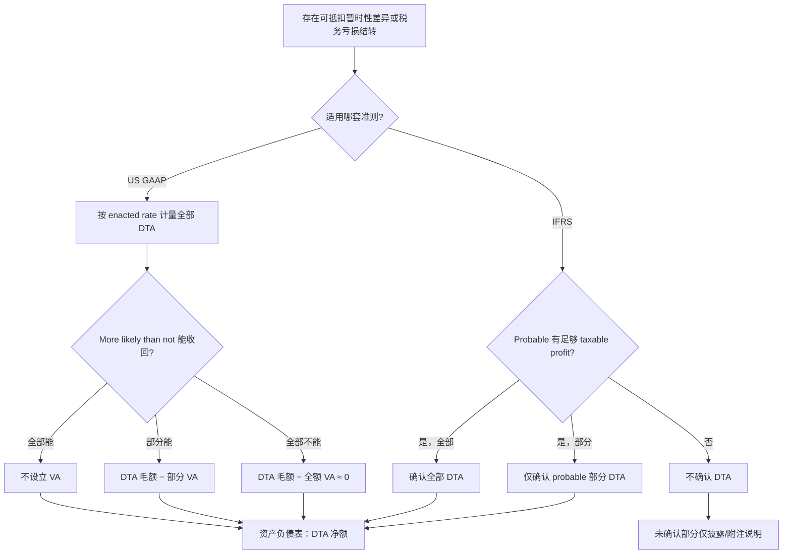

# US GAAP 与 IFRS 下 DTA 确认及 Valuation Allowance 对比

> **TL;DR**：US GAAP 用 **Valuation Allowance** 减记 DTA；IFRS **无 VA**，仅确认 **probable** 能利用的部分。
> **关键依据**：IAS 12 §24–37；ASC 740-10-30-5(e)、740-10-30-16–24
> **适用场景**：评估 DTA 可实现性、编制调节表、理解 IFRS/US GAAP 所得税差异时

## 问题

### 背景

US GAAP 下递延所得税资产（DTA）可通过 Valuation Allowance（VA）减记；实务中常简称「VA 掉 DTA」。

### 决策问题

1. IFRS 是否有与 VA 对应的概念？
2. 两套准则在 DTA **确认门槛**和**列报方式**上有何差异？

### 边界

- 本文聚焦 DTA **确认与减记机制**，不展开适用税率选择（见 [[适用税率选择及计算]]）

---

## 总体框架

两套准则均采用**资产负债表负债法**，对可抵扣暂时性差异和税务亏损结转均可能产生 DTA。核心差异在于：**无法实现的部分如何反映**。

| 维度 | US GAAP（ASC 740） | IFRS（IAS 12） |
|------|-------------------|----------------|
| **确认逻辑** | 先**全额确认** DTA，再评估是否需要 VA | **仅确认**很可能（probable）能利用的部分 |
| **减记机制** | **Valuation Allowance**（备抵账户） | **不予确认**（无备抵科目） |
| **可实现性门槛** | More likely than not（>50%） | Probable（很可能） |
| **列报** | DTA **扣除 VA 后**净额列示 | 仅列示已确认的 DTA 净额 |
| **后续变化** | 调整 VA → 计入所得税费用 | 重新评估未确认 DTA → 满足条件时**新增确认** |

> **实务要点**：IFRS **没有 Valuation Allowance 这一科目**；不能实现的部分直接体现在「确认的 DTA 金额较小」，而非「毛 DTA − VA」。

### 术语对照

| 中文 | 英文 | 准则 |
|------|------|------|
| 递延所得税资产 | Deferred Tax Asset (DTA) | IAS 12 / ASC 740 |
| 估值备抵 | Valuation Allowance (VA) | ASC 740（IFRS 无对应科目） |
| 很可能 | Probable | IAS 12 |
| 更可能 than not（>50%） | More likely than not | ASC 740 |
| 未确认递延所得税资产 | Unrecognised deferred tax assets | IAS 12 §37 |

---

## 一、US GAAP：DTA + Valuation Allowance

**准则来源**：[[03 - 知识库/US GAAP/ASC准则/ASC 740 - Income Taxes|ASC 740]]

### 1. DTA 定义与 VA 机制

> **ASC 740-10-25-20 / Glossary — Deferred Tax Asset（知识库原文）：**
>
> The deferred tax consequences attributable to deductible temporary differences and carryforwards. A deferred tax asset is measured using the applicable enacted tax rate and provisions of the enacted tax law. **A deferred tax asset is reduced by a valuation allowance if, based on the weight of evidence available, it is more likely than not that some portion or all of a deferred tax asset will not be realized.**

> **ASC 740-10-25-20 / Glossary — Valuation Allowance（知识库原文）：**
>
> **The portion of a deferred tax asset for which it is more likely than not that a tax benefit will not be realized.**

**中文提炼**：

- 先按可抵扣暂时性差异和结转项目**计量全部 DTA**
- 若证据表明**超过 50% 的可能性**部分或全部 DTA 无法收回 → 设立 VA
- VA 将 DTA **减记**至「more likely than not 可实现」的金额

### 2. 计量步骤（ASC 740-10-30-5）

> **ASC 740-10-30-5（知识库原文）：**
>
> Deferred taxes shall be determined separately for each tax-paying component in each tax jurisdiction. That determination includes the following procedures:
> (a) Identify the types and amounts of existing temporary differences and carryforwards...
> (b) Measure the total deferred tax liability for taxable temporary differences...
> (c) **Measure the total deferred tax asset** for deductible temporary differences and operating loss carryforwards...
> (d) Measure deferred tax assets for each type of tax credit carryforward.
> (e) **Reduce deferred tax assets by a valuation allowance** if, based on the weight of available evidence, it is more likely than not (a likelihood of more than 50 percent) that some portion or all of the deferred tax assets will not be realized. **The valuation allowance shall be sufficient to reduce the deferred tax asset to the amount that is more likely than not to be realized.**

### 3. VA 评估证据（ASC 740-10-30-16 至 30-24）

| 项目 | 要求 |
|------|------|
| 证据类型 | 所有可得证据，**正面与负面**均须考虑 |
| 未来应税 income 来源 | (a) 现有应纳税暂时性差异转回；(b) 未来应税利润；(c) 向前期 carryback；(d) **税务筹划策略** |
| 负面证据 | 近年**累计亏损**是重要负面证据，难以克服（740-10-30-21、30-23） |
| 部分 VA | 若预期仅部分 DTA 无法实现，须判断分界并设立相应 VA（740-10-30-24） |

> **ASC 740-10-30-23（知识库原文）：**
>
> A cumulative loss in recent years is a significant piece of negative evidence that is difficult to overcome.

### 4. 列报

> **ASC 740-10-45-6（知识库原文）：**
>
> For a particular tax-paying component of an entity and within a particular tax jurisdiction, **all deferred tax liabilities and assets, as well as any related valuation allowance, shall be offset and presented as a single noncurrent amount.**

- 资产负债表：**DTA（扣除 VA 后）** 与 DTL 在同一纳税主体、同一管辖区抵销后列示
- 利润表：VA 变动计入**所得税费用**（740-10-45-14(c)）

---

## 二、IFRS：Probable 门槛下的有限确认

**准则来源**：[[03 - 知识库/IFRS/IAS准则/IAS 12 - Income Taxes|IAS 12]]

### 1. 无 Valuation Allowance 概念

IFRS 对 DTA 采用**确认门槛**，而非「全额确认 + 备抵减记」：

> **IAS 12 Paragraph 24（知识库原文）：**
>
> A deferred tax asset shall be recognised for all deductible temporary differences **to the extent that it is probable that taxable profit will be available** against which the deductible temporary difference can be utilised, unless the deferred tax asset arises from the initial recognition of an asset or liability in a transaction that [meets paragraphs 15(b) criteria]...

> **IAS 12 Paragraph 27（知识库原文）：**
>
> Therefore, an entity **recognises deferred tax assets only when it is probable** that taxable profits will be available against which the deductible temporary differences can be utilised.

**中文提炼**（知识库）：

- 可抵扣暂时性差异 → DTA **仅就很可能能利用的部分确认**
- 不满足 probable 的部分 → **直接不确认**，不设 VA 备抵

### 2. 「Probable」的判断依据（IAS 12 §28–29）

> **IAS 12 Paragraph 28（知识库原文）：**
>
> It is probable that taxable profit will be available against which a deductible temporary difference can be utilised when there are **sufficient taxable temporary differences** relating to the same taxation authority and the same taxable entity which are expected to reverse:
> (a) in the same period as the expected reversal of the deductible temporary difference; or
> (b) in periods into which a tax loss arising from the deferred tax asset can be carried back or forward.

> **IAS 12 Paragraph 29（知识库原文）：**
>
> When there are insufficient taxable temporary differences... the deferred tax asset is recognised to the extent that:
> (a) it is probable that the entity will have sufficient taxable profit... in the same period as the reversal... or
> (b) **tax planning opportunities** are available to the entity that will create taxable profit in appropriate periods.

| 证据来源 | 说明 |
|---------|------|
| 应纳税暂时性差异转回 | 最常见支持来源 |
| 未来应税利润（不含未来 originating 差异） | 须单独评估是否 sufficient |
| 税务筹划机会 | 类似 US GAAP tax-planning strategies（§30） |
| 税务亏损/税收抵免结转 | 同 DTA 确认标准，但**亏损存在本身是未来利润可能不足的强证据**（§34–36） |

### 3. 税务亏损的特殊要求（IAS 12 §34–36）

> **IAS 12 Paragraph 34–36（知识库原文）：**
>
> A deferred tax asset shall be recognised for the carryforward of unused tax losses and unused tax credits **to the extent that it is probable that future taxable profit will be available**...
>
> ...the existence of unused tax losses is **strong evidence that future taxable profit may not be available**. Therefore, **when an entity has a history of recent losses**, the entity recognises a deferred tax asset arising from unused tax losses or tax credits **only to the extent that** the entity has **sufficient taxable temporary differences** or there is **convincing other evidence** that sufficient taxable profit will be available...
>
> To the extent that it is not probable that taxable profit will be available... **the deferred tax asset is not recognised.**

### 4. 后续重新评估（IAS 12 §37）

> **IAS 12 Paragraph 37（知识库原文）：**
>
> At the end of each reporting period, an entity **reassesses unrecognised deferred tax assets**. The entity **recognises a previously unrecognised deferred tax asset** to the extent that it has become probable that future taxable profit will allow the deferred tax asset to be recovered.

- 未确认的 DTA **不在账上**
- 条件改善时 → **新增确认** DTA，计入当期所得税费用/收益
- 无「冲减 VA」这一步骤

### 5. 列报与抵销（IAS 12 §56–74）

> **IAS 12 Paragraph 74（知识库原文）：**
>
> An entity shall offset deferred tax assets and deferred tax liabilities if, and only if:
> (a) the entity has a legally enforceable right to set off current tax assets against current tax liabilities; and
> (b) the deferred tax assets and the deferred tax liabilities relate to income taxes levied by the same taxation authority on either the same taxable entity or [ qualifying group entities ]...

- IFRS 资产负债表列示的是**已确认 DTA** 与 DTL 抵销后的净额
- **不存在 VA 行或附注备抵**

---

## 三、对比总结

### 机制对比

| 情形 | US GAAP | IFRS |
|------|---------|------|
| 可抵扣暂时性差异 100，仅 60% 很可能实现 | DTA 100 − VA 40 = **60** | DTA **60**（40 不确认） |
| 全部不太可能实现 | DTA 100 − VA 100 = **0**（或仅列 VA 全额） | DTA **0**（完全不确认） |
| 后续前景改善，70% 可实现 | 减少 VA 10 → DTA 净额 70 | 新增确认 DTA 10 → 总额 70 |
| 备抵科目 | **Valuation Allowance** | **无** |

### 门槛与证据对比

| 维度 | US GAAP | IFRS |
|------|---------|------|
| 门槛表述 | More likely than not（>50%） | Probable（很可能） |
| 近年亏损 | 重大负面证据，难以支持无 VA | 强证据；亏损结转 DTA 需 temp diff 或 **convincing other evidence** |
| 税务筹划 | Tax-planning strategies（740-10-30-19） | Tax planning opportunities（IAS 12 §30） |
| 部分确认 | 通过**部分 VA** | 通过**部分确认 DTA** |

### 利润表影响

| 事件 | US GAAP | IFRS |
|------|---------|------|
| 首次认为部分 DTA 不可实现 | 设立 VA → **所得税费用增加** | 不确认该部分 → **无 DTA、无费用** |
| 后续认为可收回 | 转回 VA → **所得税费用减少** | 确认 previously unrecognised DTA → **所得税费用减少** |

> 长期效果类似，但 **US GAAP 利润表可能因 VA 变动产生较大波动**；IFRS 仅在确认/转回 DTA 时影响费用。

---

## 四、判断流程

---

## 结论

### 准则结论

1. **你的理解正确**：US GAAP 下 DTA 可被 **Valuation Allowance** 减记；IFRS **没有 VA 概念**。
2. **IFRS 的处理方式**：对 DTA 采用 **probable 确认门槛**——仅确认很可能能利用的部分；不能利用的部分**直接不确认**。
3. **列报差异**：US GAAP 为「毛 DTA − VA」；IFRS 为「已确认 DTA 净额」，净额可能一致但科目结构不同。
4. **亏损场景更严**：IFRS §34–36 对 unused tax losses 有额外限制；US GAAP 通过 VA + 累计亏损负面证据体现。
5. **后续处理**：US GAAP 调整 VA；IFRS 重新评估 unrecognised DTA 并在条件满足时确认（§37）。

### 操作结论

| 情形 | US GAAP | IFRS |
|------|---------|------|
| 部分 DTA 可能无法实现 | 全额确认 DTA，设立 **VA** | **仅确认** probable 部分 |
| 工作底稿 | 跟踪 DTA 毛额与 VA 变动 | 跟踪已确认 vs 未确认 DTA |
| 与审计沟通 | 强调 VA 证据权重（740-10-30-17–23） | 强调 probable 与未来 taxable profit |

## 实务提示

- 调节 US GAAP 报表至 IFRS 时，VA 变动与 IFRS DTA 确认/转回时点可能不同，需单独调节
- IFRS 近年亏损场景下确认 DTA 需 **convincing other evidence**（§36），不可仅依赖 optimistic forecast
- US GAAP 的 tax-planning strategies（740-10-30-19）与 IFRS tax planning opportunities（§30）概念类似，但机制仍不同

## 相关项目

- [[适用税率选择及计算]] — 同一 IAS 12 下的税率调节表适用税率选择

## 准则索引（知识库）

| 准则 | 文件 | 核心段落 |
|------|------|---------|
| IAS 12 | [[03 - 知识库/IFRS/IAS准则/IAS 12 - Income Taxes\|IAS 12 - Income Taxes]] | §24–37（DTA 确认）、§56–74（抵销列报） |
| ASC 740 | [[03 - 知识库/US GAAP/ASC准则/ASC 740 - Income Taxes\|ASC 740 - Income Taxes]] | 740-10-30-5/16–24（VA）、740-10-45-6（列报） |

---

## 日志

- 2026-06-18：初稿，基于知识库 IAS 12、ASC 740 原文整理
- 2026-06-18：v2 — 按项目编写说明 v2 增加 TL;DR、type C、术语表、分层结论、相关项目
